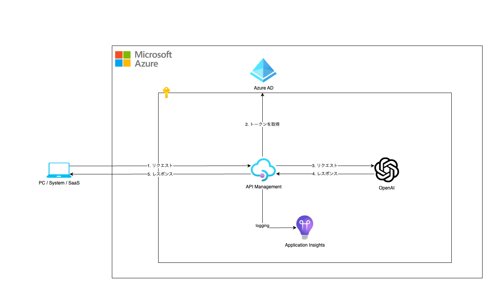

# 概要

API Management を利用し Azure OpenAI の利用ログを収集する構成の Terraform です。

# 構成



# 準備

## 環境

- 有効な Azure Subscription
- [Azure CLI](https://learn.microsoft.com/ja-jp/cli/azure/install-azure-cli)
- [Terraform](https://developer.hashicorp.com/terraform/tutorials/aws-get-started/install-cli)

## 変数ファイル(terraform.tfvars)を作成

```hcl:terraform.tfvars
subscription_id = "00000000-0000-0000-0000-000000000000"

apim_publisher_name  = "Your Name"
apim_publisher_email = "example@example.com"

health_alert_user_name          = "Your Name"
health_alert_user_email_address = "example@example.com"
```

# デプロイ

## サブスクリプションの設定

```bash
# ログイン
az login

# 利用するサブスクリプションが設定されていることを確認
az account show --output table
```

## Terraform の初期化

```bash
terraform init -upgrade
```

## Terrafrom 実行プランを作成

```bash
terraform plan -out main.tfplan
```

## Terraform 実行プランを適用

```bash
terraform apply main.tfplan
```

# クリーンアップ

```bash
terraform destroy
```
